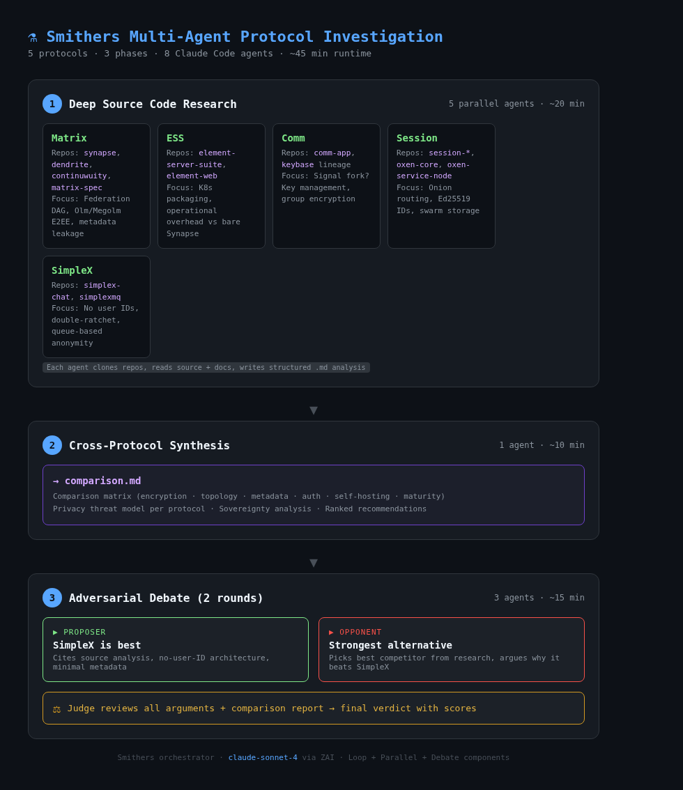

# Messaging Protocol Deep-Dive

Smithers multi-agent investigation comparing 5 messaging protocols for a cryptography/TEE research community.

## Workflow

3-phase pipeline running 8 Claude Code agents via Smithers orchestrator:

1. **Parallel source code research** — 5 agents clone repos, analyze source + docs, write structured reports
2. **Cross-protocol synthesis** — 1 agent builds a comparison matrix from all research
3. **Adversarial debate** — 2 rounds of proposer vs opponent, judge delivers verdict

## Protocols Analyzed

| Protocol | Analysis | Crypto Details | Verdict |
|----------|----------|---------------|---------|
| **Matrix** | [matrix.md](matrix.md) | [matrix-crypto.md](matrix-crypto.md) | Best for sovereignty, recommended for this use case |
| **ESS** | [ess.md](ess.md) | [ess-crypto.md](ess-crypto.md) | Enterprise Matrix packaging — adds K8s complexity, same trust model |
| **Comm** | [comm.md](comm.md) | [comm-crypto.md](comm-crypto.md) | Fundamentally insecure — no E2EE, no auth, avoid |
| **Session** | [session.md](session.md) | [session-crypto.md](session-crypto.md) | Best for anonymity via onion routing, but no self-hosting |
| **SimpleX** | Not completed (research agent timed out) | — | Strong privacy on paper (no user IDs), but no data collected |

## Key Findings

**Comparison Report**: [comparison.md](comparison.md)

### Rankings

| Priority | Winner | Rationale |
|----------|--------|-----------|
| Absolute privacy/anonymity | **Session** | Onion routing, no personal IDs, crypto-only identities |
| Community self-hosting & sovereignty | **Matrix** | Multiple server implementations, federation, no vendor lock-in |
| 20-50 person crypto/TEE community | **Matrix** | Best balance of sovereignty, crypto maturity, and features |
| Long-term viability | **Matrix/ESS** | Largest ecosystem, active standardization, enterprise investment |

### Critical Trade-offs

- **Matrix**: Rich features = rich metadata. Homeservers see social graphs, timing, room membership.
- **Session**: Maximum anonymity, but no federation. You trust the public service node network.
- **ESS**: Enterprise features at enterprise complexity. No sovereignty gain over vanilla Matrix.
- **Comm**: Elegant P2P architecture with zero security. Research project, not a protocol.
- **SimpleX**: No-user-ID model is compelling, but couldn't verify from source (timeout).

### Recommendation

For a community that values sovereignty > privacy > usability > features:

**Matrix with Continuwuity** — self-hosted, federated, auditable E2EE, multiple client options. Disable metadata-heavy features (typing indicators, presence, read receipts). Restrict federation to trusted servers.

If absolute anonymity matters more than infrastructure control, **Session** is the alternative.

**Avoid**: Comm (insecure). ESS (unnecessary complexity unless you need enterprise compliance).

## Methodology

Each protocol's source code was cloned and analyzed by a separate Claude Code agent:
- Repository structure, build system, dependency analysis
- Crypto implementation (algorithms, key management, forward secrecy)
- Network topology and message routing
- Metadata exposure profile
- Client ecosystem maturity

The synthesis agent read all individual reports and produced the cross-protocol comparison. The debate agent then argued SimpleX vs strongest alternative (Matrix) for 2 rounds before a judge delivered the final verdict.

## Previous Work

- [Matrix vs ESS debate (Continuwuity won 8-6)](../matrix-compare-continuwuity-vs-ess.md)
